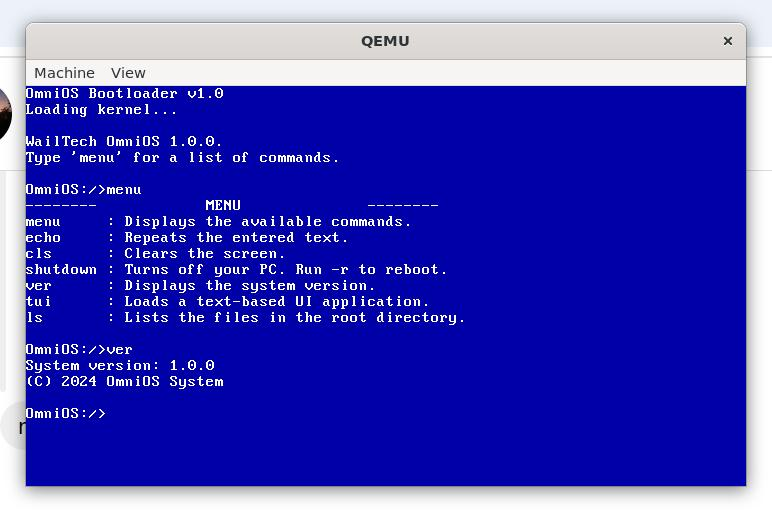

# OmniOS

OmniOS is a lightweight operating system written in 16-bit assembly, designed for simplicity and a deeper understanding of low-level programming.



## Features
- **Simple Shell**: A minimal command-line interface to interact with the OS.
- **Built-in Commands**: Includes basic commands for file navigation and output.
- **Disk Image Support**: Creates a FAT12 disk image for booting the system.
- **QEMU Support**: Easily test and run the OS in QEMU.

## Requirements
- **NASM**: For assembling the source code.
- **QEMU**: To run the OS.
- **mtools**: To manage FAT12 file systems.
- **dd**: For creating and modifying disk images.

## Installation and Running OmniOS

### Step 1: Build the OS
Run the provided `build.sh` script to assemble the source code, create the disk image, and copy files.

```bash
# Make the script executable
chmod +x build.sh

# Execute the build script
./build.sh
```

### Step 2: Run OmniOS in QEMU
After building the OS, you can test it in QEMU:

```bash
qemu-system-i386 -boot c -m 256 -fda build/OmniOS.img
```
All Done!

### Detailed Build Process
If you want to understand what the `build.sh` script does, here's a breakdown:

**1.Assembly:** Convert assembly files to binary format.
```bash
mkdir build
nasm -f bin -o build/boot.bin src/Boot/Boot.asm
nasm -f bin -o build/kernel.bin src/kernel.asm
```
**2.Disk Image Creation:** Create a FAT12 image and write the bootloader.
```bash
dd if=/dev/zero of=build/OmniOS.img bs=512 count=2880
mkfs.fat -F 12 -n "OmniOS" build/OmniOS.img
dd if=build/boot.bin of=build/OmniOS.img conv=notrunc
```
**3.File Copying:** Add kernel and other files to the disk image.
```bash
mcopy -i build/OmniOS.img build/kernel.bin "::kernel.bin"
mcopy -i build/OmniOS.img build/test.txt "::test.txt"
mcopy -i build/OmniOS.img build/system "::system"
```
**4.Run:** Execute the system in QEMU.
```bash
qemu-system-i386 -boot c -m 256 -fda build/OmniOS.img
```
### Usage
Once OmniOS boots, you will see a simple shell interface. You can type commands such as:

`help` - View available commands.
`echo` - Display a message.
`shutdown` - Power off the OS.
*And more..*

## License
OmniOS is released under the *MIT License*. See the LICENSE file for more information.


